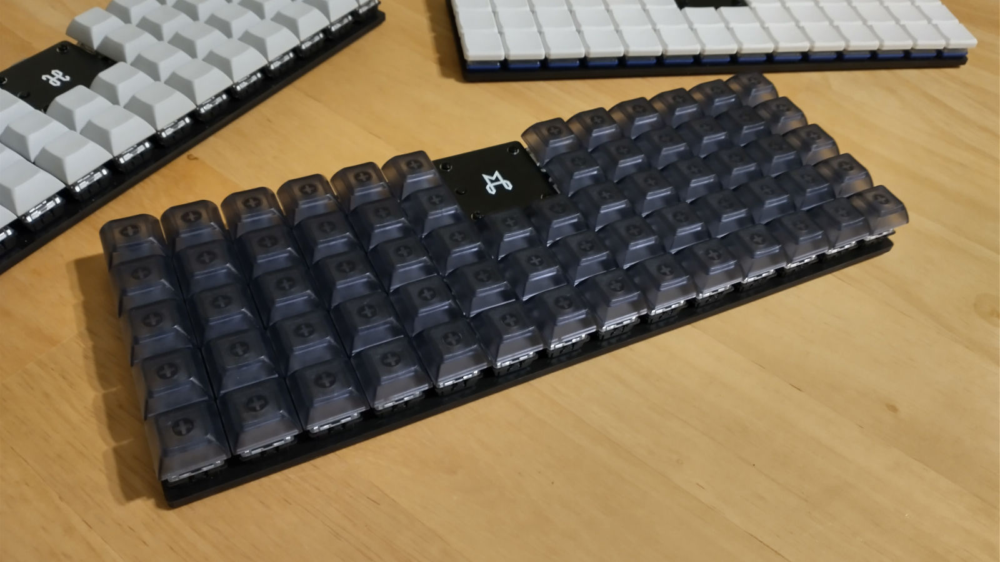
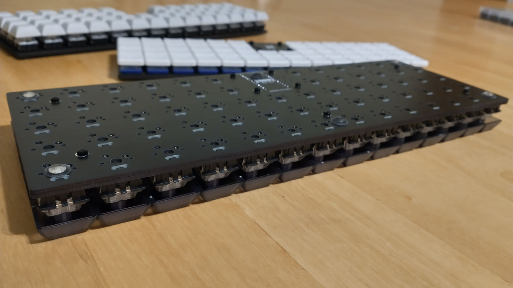

# Morizon Keyboard

Morizon is a 5-row version of the Horizon keyboard.

This project is a direct modification of the Horizon project. The schematic and PCBs have been modified to support this 5-row layout.

As with Horizon, two separate PCB designs are available in the [`gerbers`](gerbers) folder: one for MX switches (19mm x 19mm spacing), and one for Choc switches (18mm x 17mm spacing).

Please refer to the [Horizon keyboard repository](https://github.com/skarrmann/horizon) for project documentation. Only Morizon-specific details are noted below!

## Keyboard firmware

* [QMK](https://github.com/qmk/qmk_firmware/tree/master/keyboards/morizon)
* ZMK
    * Morizon shield definition is in [skarrmann's zmk-config](https://github.com/skarrmann/zmk-config)

## Bill of materials

Same as the [Horizon keyboard BOM](https://github.com/skarrmann/horizon/#bill-of-materials), but you will also need:

* Morizon PCBs (instead of Horizon PCBs)
* 14 more keyswitches
* 14 more keycaps
* 14 more 1N4148 SOD-123 diodes
* 1 more M2 6mm screw
* 1 more M2 nut

## Revision History

* **Rev1** (2022-02-05)
    * PCB: Create MX and Choc boards with bottom and top plates (based on Horizon).
    * Schematic: Wire as 66 key 10x7 matrix.
* **Rev1.1** (2022-03-21)
    * PCB, Schematic: No physical changes. Files upgraded to KiCad 6, and Gerber files regenerated using Horizon Board Producer 2.3.
* **Rev1.2** (2023-11-09)
    * PCB, Schematic: No physical changes. Files upgraded to KiCad 7, and Gerber files regenerated using Horizon Board Producer 2.4.